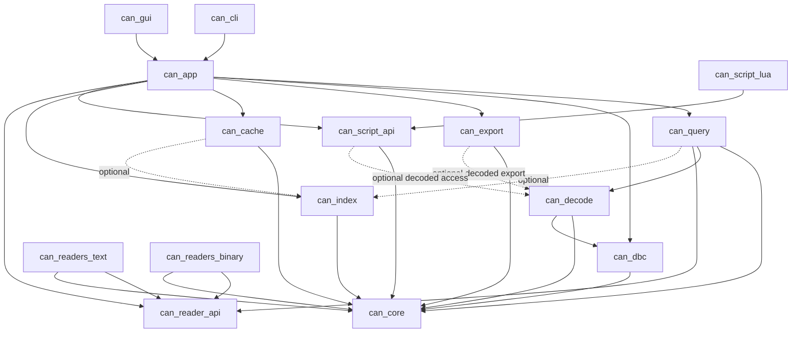

# Architecture Overview

## 1. Purpose

This document proposes the software architecture for CAN Trace Explorer. The
architecture is designed to satisfy the requirements in
[`../requirements.md`](../requirements.md) while preserving:

- Performance for very large traces
- Modular development in modern C++
- Portability across Linux and Windows
- Vendor independence
- A phased rollout: core libraries first, CLI validation next, GUI later

## 2. Architectural Drivers

### Functional Drivers

- Unified internal CAN event model (`DATA-REQ-001` to `DATA-REQ-005`)
- Multiple trace readers through a plugin-style reader framework
  (`IO-REQ-001` to `IO-REQ-003`)
- DBC loading and decoding (`DBC-REQ-001` to `DBC-REQ-009`)
- Streaming query execution with raw-filter-first behavior
  (`QRY-REQ-007`, `QRY-REQ-008`)
- Optional indexing and internal cache support
  (`PERF-REQ-002`, `CACHE-REQ-001` to `CACHE-REQ-005`)
- CLI now and GUI later (`CLI-REQ-*`, `GUI-REQ-*`)
- Optional scripting without making it part of the core processing path
  (`EXT-REQ-010`)

### Non-Functional Drivers

- At least 1 million messages per second on a modern desktop CPU
  (`PERF-REQ-004`)
- Streaming processing without loading the full trace into memory
  (`PERF-REQ-001`, `NFR-PERF-001`)
- Minimal heap allocation on the event hot path
  (`DATA-REQ-004`, `PERF-REQ-005`)
- Modular and independently testable components
  (`SYS-REQ-006`, `NFR-MAINT-001`, `NFR-MAINT-002`)
- Portable core modules with no platform-specific APIs
  (`SYS-REQ-005`, `NFR-PORT-002`)

## 3. Architectural Style

The proposed architecture is a layered, pipeline-oriented modular system:

1. Domain layer
   Defines the canonical CAN event model, query model, decode model, and core
   service contracts.
2. Processing layer
   Implements reading, filtering, decoding, indexing, caching, export, and
   script adaptation.
3. Adapter layer
   Isolates concrete file formats, DBC parsing, export formats, Lua binding,
   and future live CAN integration.
4. Application layer
   Hosts the CLI now and the GUI later, both using the same application
   services.

This keeps core logic reusable and prevents frontend concerns from leaking into
 the processing path.

## 4. Top-Level Building Blocks

### 4.1 Core Domain

Owns stable domain types:

- `CanEvent`
- `FrameType`
- `TraceMetadata`
- `QuerySpec`
- `FilterExpr`
- `DecodedMessageView`
- `DecodedSignalView`
- `ContextRequest`

This layer must remain plain C++ and toolkit-independent.

### 4.2 Reader Framework

Provides a common contract for:

- Format probing
- Opening a trace
- Reading events in chunks
- Reporting metadata and capabilities

Concrete readers are adapters behind the common reader interface.

### 4.3 Database and Decode Subsystem

Provides:

- DBC parsing and validation
- Message and signal model
- Decode lookup by CAN ID
- Raw frame to decoded signal transformation

This subsystem must also support operation when no DBC is loaded.

### 4.4 Query and Filtering Subsystem

Provides:

- Raw predicates: timestamp, CAN ID, bus, frame type
- Decoded predicates: message name, signal conditions
- Boolean composition: AND, OR, NOT
- Stream execution
- Context retrieval around a selected match

This subsystem is the main coordinator for processing order:
raw filters first, decoding only when required.

### 4.5 Index and Cache Subsystem

Provides:

- Optional sidecar or internal indexes
- Chunk-based internal cache storage
- Fast random access by chunk and event offset
- Query acceleration for large datasets

The cache is an optimization layer, not a required ingestion format.

### 4.6 Export Subsystem

Provides:

- Export of raw filtered traces
- Export of decoded signals
- Export to CSV initially
- Export to columnar format through a separate adapter later

### 4.7 Scripting Subsystem

Provides:

- A stable scripting API boundary
- Lua as the first runtime
- Optional enable or disable behavior at runtime

The scripting subsystem must remain optional and must not be required for core
trace reading, decoding, indexing, or filtering.

### 4.8 Application Services

Provides stable use-case APIs consumed by frontends:

- Load trace
- Load DBC
- Build cache
- Build index
- Execute query
- Retrieve context
- Export results
- Run benchmark

This layer is where CLI and GUI converge.

### 4.9 Frontends

- CLI:
  the first integration target and validation surface
- GUI:
  a later presentation layer using the same application services

## 5. Software Component View

The architecture is organized around the following software components.

### 5.1 Core Components

- `can_core`
  Canonical domain model and shared value types
- `can_reader_api`
  Reader contracts and factory contracts
- `can_dbc`
  Database model and DBC loading
- `can_decode`
  Frame decoding services
- `can_query`
  Query planning, execution, and context retrieval
- `can_index`
  Optional query acceleration indexes
- `can_cache`
  Internal chunked binary cache
- `can_export`
  Export contracts and format writers
- `can_script_api`
  Stable scripting boundary
- `can_script_lua`
  Lua runtime adapter
- `can_app`
  Application use-case orchestration
- `can_cli`
  CLI frontend
- `can_gui`
  GUI frontend

### 5.2 Static Architecture Diagram

### 5.3 Static View Interpretation

- `can_app` is the orchestration boundary shared by CLI and GUI
- `can_query` is the central processing coordinator
- concrete readers are replaceable adapters behind `can_reader_api`
- `can_core` is the lowest stable dependency and should remain highly portable
- cache, index, and scripting are optional accelerators or extensions around
  the main query path

## 6. Layering and Dependency Rules

The dependency direction shall be:

`frontend -> application services -> processing services -> domain`

Concrete adapters plug in from the side:

- Reader adapters depend on reader contracts and domain types
- Export adapters depend on export contracts and result views
- Lua adapter depends on scripting contracts and exposed views

Forbidden dependencies:

- Domain modules shall not depend on CLI, GUI, Lua, or file-format-specific
  code
- Query execution shall not depend on Dear ImGui or command-line parsing
- Core processing shall not depend on proprietary SDKs

## 7. Proposed High-Level Deployment of Responsibilities

### 7.1 Core-Only Responsibilities

- Canonical event representation
- Query planning and execution
- Decode model and decode services
- Index and cache contracts
- Public integration API

### 7.2 Adapter Responsibilities

- Specific trace file parsing
- Specific export format writing
- Specific scripting runtime integration
- Future live bus integration

### 7.3 Frontend Responsibilities

- Input handling
- Session state
- Formatting for presentation
- Interaction workflow

## 8. Key Architectural Decisions

### 8.1 Canonical Event as a Fixed-Layout Value Type

`CanEvent` should be a fixed-layout, allocation-free value type with storage
for up to 64 bytes of payload. This directly supports CAN FD and reduces
per-event allocation overhead.

### 8.2 Chunk-Based Processing as the Default Runtime Model

Readers, cache writers, and query execution should operate on event chunks
rather than single events. This reduces call overhead and enables cache and
index alignment.

### 8.3 Raw Filtering Before Decode

The query planner shall split predicates into:

- Raw predicates
- Decode-dependent predicates

Raw predicates are applied first so decoding work only happens for candidate
events.

### 8.4 CLI and GUI on Shared Application Services

The CLI and future GUI shall not reimplement query or decode behavior. Both
must use the same application service API.

## 9. Architectural Scope Versus Detailed Design

This proposal defines architecture, not detailed design.

Included here:

- software components
- their responsibilities
- allowed dependencies
- static structure
- dynamic use-case interactions
- system-wide design rules

Deferred to detailed design:

- class diagrams inside each component
- exact public C++ APIs
- error type taxonomy
- memory layout details beyond architecture-level constraints
- parser internals
- specific algorithms and data structures for each module

## 10. External Boundaries

External boundaries are:

- Trace files
- DBC files
- Export files
- Lua scripts
- Future live CAN interfaces
- External tools using the public C++ API

Each boundary shall be isolated behind an explicit adapter or interface.

## 11. Traceability Summary

This architecture primarily addresses:

- `SYS-REQ-001` to `SYS-REQ-007`
- `DATA-REQ-001` to `DATA-REQ-005`
- `IO-REQ-001` to `IO-REQ-032`
- `DBC-REQ-001` to `DBC-REQ-009`
- `QRY-REQ-001` to `QRY-REQ-017`
- `PERF-REQ-001` to `PERF-REQ-006`
- `CACHE-REQ-001` to `CACHE-REQ-005`
- `CLI-REQ-001` to `CLI-REQ-005`
- `EXT-REQ-001` to `EXT-REQ-010`
- GUI requirements through frontend readiness rather than phase-1 delivery
