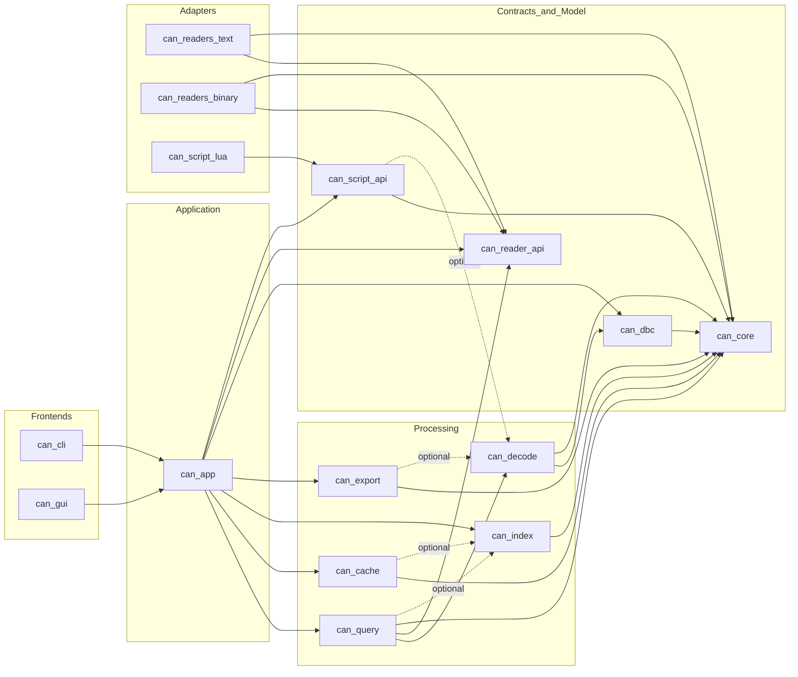

# Module Decomposition

## 1. Purpose

This document proposes the module and library decomposition for CAN Trace
Explorer. The decomposition is intended to map naturally to CMake targets and
to allow independent development and testing.

## 2. Proposed Module Map

The components below are architecture-level software components. In the
implementation they are expected to map to one or more CMake targets, but they
are defined first by responsibility and dependency boundaries, not by file
layout alone.

### 2.1 `can_core`

Responsibility:

- Canonical domain types
- Common enums and identifiers
- Query model primitives
- Basic result and error types

Key contents:

- `CanEvent`
- `FrameType`
- `BusId`
- `TimestampNs`
- `QuerySpec`
- `FilterExpr`
- `ContextRequest`

Dependencies:

- C++ standard library only

### 2.2 `can_reader_api`

Responsibility:

- Reader contracts
- Reader capability model
- Format probe interface
- Chunk reader interface

Depends on:

- `can_core`

### 2.3 `can_readers_text`

Responsibility:

- Candump/log reader
- CSV reader
- ASC reader

Depends on:

- `can_core`
- `can_reader_api`

Rationale:

These formats can be delivered in the first implementation phase without
proprietary dependencies.

### 2.4 `can_readers_binary`

Responsibility:

- BLF reader
- MDF4/MF4 reader
- TRC reader

Depends on:

- `can_core`
- `can_reader_api`

Rationale:

Keep extended binary formats isolated because they tend to be more complex and
may mature later.

### 2.5 `can_dbc`

Responsibility:

- DBC parser
- DBC model
- Lookup tables from CAN ID to message definition

Depends on:

- `can_core`

### 2.6 `can_decode`

Responsibility:

- Raw frame decoding using the loaded database
- Signal extraction
- Scaling and offset application
- Multiplex handling

Depends on:

- `can_core`
- `can_dbc`

### 2.7 `can_query`

Responsibility:

- Query planning
- Predicate partitioning
- Streaming query execution
- Context retrieval orchestration

Depends on:

- `can_core`
- `can_decode`
- `can_reader_api`
- optional `can_index`

### 2.8 `can_index`

Responsibility:

- Optional index creation
- Index loading
- Time and location mapping
- Candidate range narrowing

Depends on:

- `can_core`

### 2.9 `can_cache`

Responsibility:

- Internal binary cache format
- Chunk persistence
- Random access support
- Cache metadata

Depends on:

- `can_core`
- optional `can_index`

### 2.10 `can_export`

Responsibility:

- Export contracts
- CSV export
- Future columnar export adapters

Depends on:

- `can_core`
- optional `can_decode`

### 2.11 `can_script_api`

Responsibility:

- Stable scripting-facing data views
- Script execution contract
- Script result and error model

Depends on:

- `can_core`
- optional `can_decode`

### 2.12 `can_script_lua`

Responsibility:

- Lua runtime adapter
- Sandboxed execution boundary

Depends on:

- `can_script_api`

### 2.13 `can_app`

Responsibility:

- Application use cases
- Session orchestration
- Input source selection
- Query execution coordination
- Export coordination
- Benchmark coordination

Depends on:

- `can_core`
- `can_reader_api`
- `can_dbc`
- `can_decode`
- `can_query`
- `can_index`
- `can_cache`
- `can_export`
- optional `can_script_api`

### 2.14 `can_cli`

Responsibility:

- Command-line parsing
- Text output formatting
- CLI command dispatch

Depends on:

- `can_app`

### 2.15 `can_gui`

Responsibility:

- GUI session state
- View models
- Dear ImGui presentation

Depends on:

- `can_app`

Important rule:

`can_gui` must not introduce ImGui types into `can_app` or lower layers.

## 3. Recommended Source Tree Shape

```text
libraries/
  can_core/
  can_reader_api/
  can_readers_text/
  can_readers_binary/
  can_dbc/
  can_decode/
  can_query/
  can_index/
  can_cache/
  can_export/
  can_script_api/
  can_script_lua/
  can_app/
apps/
  can_cli/
  can_gui/
benchmarks/
tests/
```

## 4. Static Component Decomposition View

### 4.1 Component Grouping

The software components can be grouped into larger architectural subsystems:

- Frontends:
  `can_cli`, `can_gui`
- Application services:
  `can_app`
- Processing components:
  `can_query`, `can_decode`, `can_index`, `can_cache`, `can_export`
- Adaptation components:
  `can_readers_text`, `can_readers_binary`, `can_script_lua`
- Contract and model components:
  `can_core`, `can_reader_api`, `can_dbc`, `can_script_api`

### 4.2 Component-to-Subsystem Diagram



### 4.3 Component Granularity Rules

- A component should own one cohesive architectural responsibility
- Reader formats may share utility code but must remain behind one reader API
- GUI-specific logic stays in `can_gui`, not in application or processing
- Cache and index remain separate because random-access persistence and query
  acceleration evolve at different speeds

## 5. Dependency Rules

### Allowed

- Frontends may depend on `can_app`
- `can_app` may depend on processing libraries
- Adapter libraries may depend on stable contracts from lower layers
- `can_query` may use `can_decode` and optionally `can_index`

### Forbidden

- `can_core` depending on any adapter or frontend
- `can_decode` depending on CLI or GUI
- Readers depending on DBC or decoding
- Exporters depending on Dear ImGui or CLI formatting code

## 6. Ownership Boundaries

- `can_core` owns canonical event and query primitives
- `can_dbc` owns database semantics
- `can_decode` owns frame-to-signal decoding
- `can_query` owns execution planning and context selection
- `can_index` owns query acceleration structures
- `can_cache` owns internal binary persistence format
- `can_app` owns use-case orchestration
- `can_cli` and `can_gui` own presentation-specific state only

## 7. Static View Notes

- The static view intentionally shows architectural components, not classes
- The reader and scripting components are extension points
- `can_app` is a boundary component, not a place for core algorithms
- `can_core` should remain stable even when new formats, frontends, or
  scripting engines are added

## 8. Testability Strategy by Module

- `can_core`: pure unit tests
- `can_dbc`: parser and semantic tests
- `can_decode`: golden decode tests
- `can_query`: logical and streaming execution tests
- `can_index`: lookup correctness and skip-efficiency tests
- `can_cache`: serialization and random access tests
- `can_app`: integration tests
- `can_cli`: command behavior and regression tests
