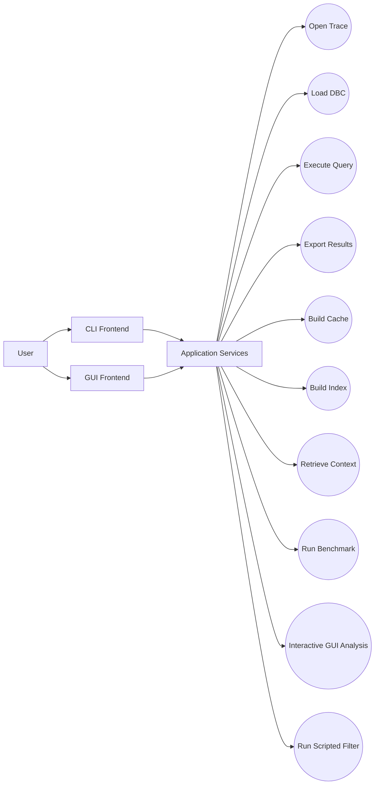
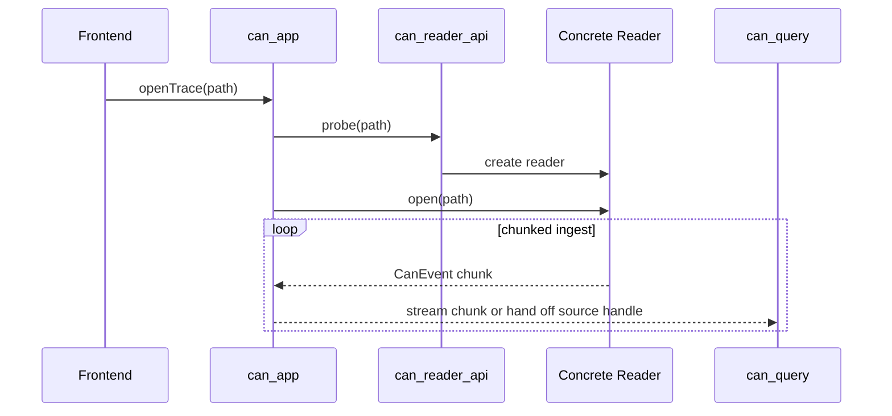
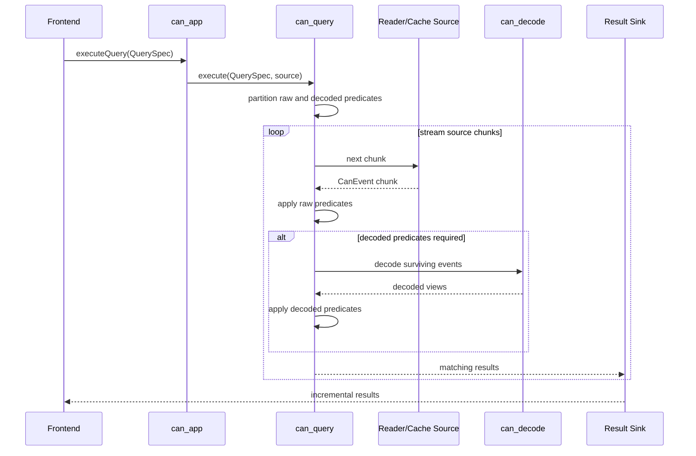
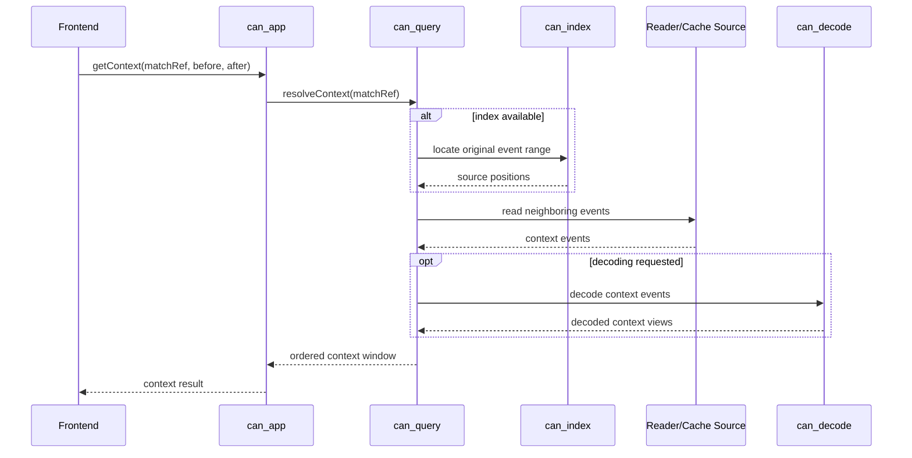
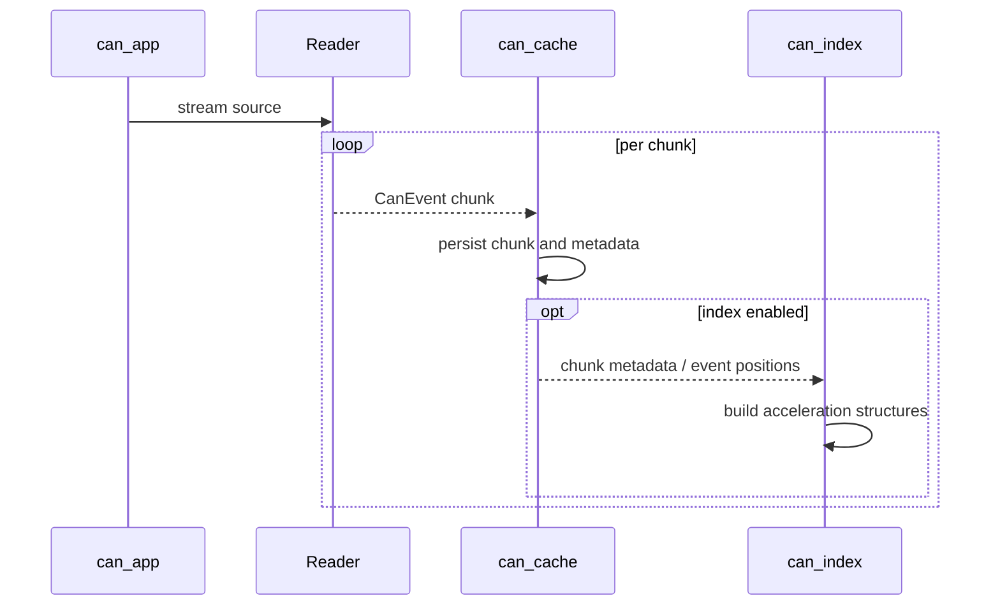
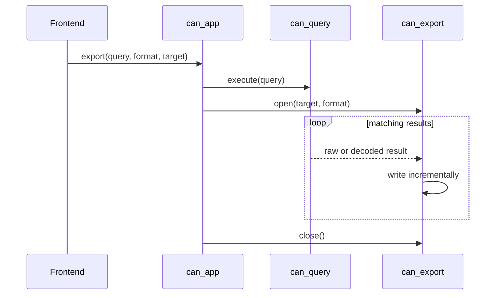
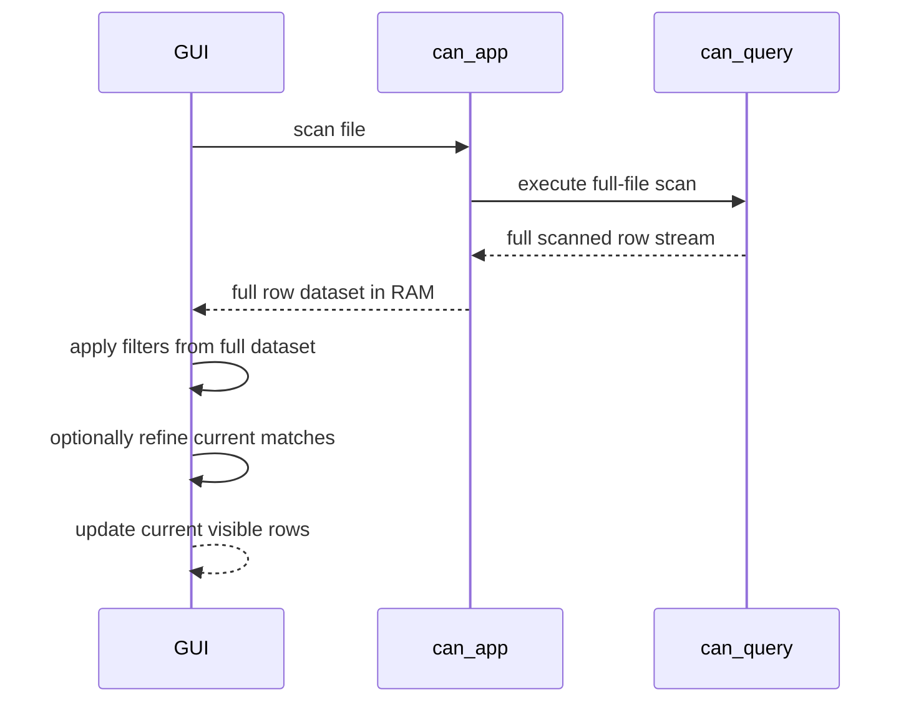

# Runtime Flows

## 1. Purpose

This document proposes the major runtime flows of the system and shows how
data moves through the architecture.

## 2. Dynamic View Scope

The dynamic view is expressed through:

- use cases
- runtime interaction flows
- data flow paths
- optional variant paths such as cache-backed or index-accelerated execution

These flows are architectural, not detailed design. They identify component
collaboration and sequencing, not class-level call stacks.

## 3. Use-Case View

### 3.1 Primary Use Cases

- Open trace with automatic reader selection
- Load optional DBC
- Execute raw filter query
- Execute decoded query
- Export filtered raw results
- Export decoded results
- Build internal cache
- Build optional index
- Retrieve context around a selected occurrence
- Run benchmark from CLI
- Future GUI interactive query and time navigation
- Optional scripted filtering or transformation

### 3.2 Use-Case Diagram

## 4. Primary Data Path

The default runtime path is:

`source -> reader -> CanEvent chunks -> raw filters -> optional decode -> result sink`

Optional acceleration and persistence paths are inserted around that core path:

- `CanEvent chunks -> cache writer`
- `cache reader -> query executor`
- `index builder -> index store -> query executor`

## 5. Trace Ingest Flow

1. Application service receives a source path.
2. Reader factory probes the source and selects a reader.
3. Reader opens the source and begins chunked streaming.
4. Reader normalizes each record into `CanEvent`.
5. Chunks are forwarded to downstream consumers:
   - query execution
   - cache builder
   - benchmark collector

Key properties:

- Streaming first
- No requirement to load the full file into memory
- Reader-specific parsing isolated from downstream stages

### 5.1 Sequence Diagram

## 6. Query Execution Flow

1. Frontend submits a `QuerySpec`.
2. Query planner splits predicates into:
   - raw predicates
   - decode-dependent predicates
3. Executor chooses source mode:
   - direct reader stream
   - cache-backed stream
   - indexed access plus stream refinement
4. Raw predicates run first.
5. Remaining candidate events are decoded only if needed.
6. Decode-dependent predicates are applied.
7. Matching events are sent to:
   - CLI formatter
   - exporter
   - GUI model adapter later

### 6.1 Sequence Diagram

### 6.2 Query Variants

- Streaming scan:
  source is a live reader stream or sequential file reader
- Cache-backed query:
  source is the internal cache reader
- Index-accelerated query:
  query executor narrows candidate regions first, then scans only selected
  areas

## 7. Context Retrieval Flow

1. User selects a matched event occurrence.
2. System resolves the match against original trace order.
3. Context resolver retrieves preceding and following events.
4. Raw and decoded views are produced as needed for output.

Key rule:

Context is resolved against the original trace, not just the currently
filtered result set.

### 7.1 Sequence Diagram

## 8. Decode Flow

1. Event arrives at the decode stage.
2. Decoder checks if a database is loaded.
3. Decoder looks up message definition by CAN ID.
4. If a definition exists, signal extraction is performed.
5. Scaling, offset, sign rules, endianness, and multiplexing are applied.
6. A decoded view is returned without mutating the original `CanEvent`.

## 9. Cache Build Flow

1. Input source is streamed through a reader.
2. `CanEvent` chunks are written to the cache format.
3. Cache metadata is recorded per chunk.
4. Optional indexes are built alongside the cache.
5. Cache artifacts are reopened later as query sources.

### 9.1 Sequence Diagram

## 10. Export Flow

1. Query executor produces matching raw or decoded results.
2. Export adapter is opened for the requested format.
3. Results are written incrementally.
4. Export is finalized with metadata and flush.

Key property:

Export remains streaming where possible and does not require materializing the
full result set.

### 10.1 Sequence Diagram

## 11. Scripting Flow

1. Scripting is explicitly enabled by the application layer.
2. Lua adapter compiles and validates the script.
3. Script hooks are applied on approved data views:
   - raw event
   - decoded view
4. Script output is consumed by query or export stages.

Key rule:

If scripting is disabled, the core path remains unchanged.

## 12. GUI Interactive Flow Preparation

The GUI interactive flow is:

`UI interaction -> optional scan request -> full row dataset in RAM -> in-memory filtering -> UI refresh`

Important consequences:

- The GUI may decouple scan-time file reading from later filter edits
- Session state belongs above the application service layer
- The full scanned dataset and the current match dataset are separate frontend-owned runtime structures
- Time navigation can operate on the current match dataset after a scan without rereading the trace file

### 12.1 Sequence Diagram

## 13. Dynamic View Notes

- The dynamic view is centered on use cases, not on internal classes
- `can_app` coordinates use cases but should not absorb core processing logic
- `can_query` is the primary runtime collaboration hub
- cache and index are variant paths that optimize, but do not redefine, the
  base runtime behavior
