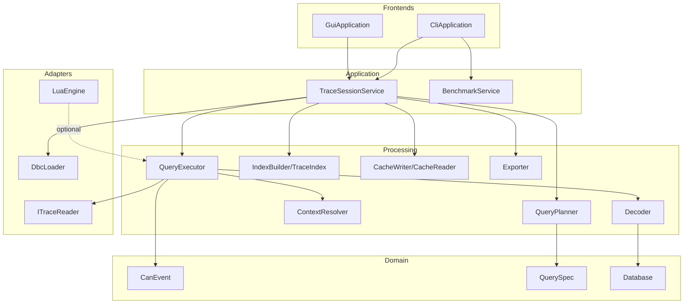

# Component Detailed Design

## 1. Purpose

This document provides the detailed design for each software component defined
by the architecture. It refines the architecture into internal structures,
classes, responsibilities, ownership boundaries, and implementation patterns
without dropping to file-by-file coding detail.

All names and structural choices in this document are aligned with
[`../guide_lines.md`](../guide_lines.md).

## 2. `can_core`

### Purpose

Provide the canonical domain model and stable value types used throughout the
system.

### Main Responsibilities

- Define `CanEvent`
- Define query model primitives
- Define common IDs, enums, and result types
- Define non-allocating event and view-friendly data structures

### Main Public Types

- `struct CanEvent`
- `struct TraceMetadata`
- `struct ContextRequest`
- `struct QuerySpec`
- `struct MatchReference`
- `enum class FrameType`
- `enum class FilterOperator`
- `enum class LogicalOperator`
- `struct ErrorInfo`

### Internal Design

`CanEvent` is a fixed-layout value type holding:

- `timestampNs`
- `canId`
- `dlc`
- `channel`
- `frameType`
- fixed payload storage of 64 bytes

`QuerySpec` contains:

- raw predicate tree
- decoded predicate tree
- result projection settings
- context retrieval settings
- output mode flags

### Ownership Rules

- All core types use value semantics where possible
- `CanEvent` is passed by value or by `const&` depending on context
- chunk containers own event storage
- decoded or exported stages may reference `CanEvent` but do not own it

### Performance Notes

- No dynamic allocation per event
- core types must remain trivially serializable where practical
- avoid virtual dispatch in hot-path domain objects

### Verification

- Layout tests for `CanEvent`
- serialization compatibility tests for core value types
- query model construction tests

## 3. `can_reader_api`

### Purpose

Define the stable contracts for reading traces from any supported source.

### Main Responsibilities

- Reader interface definition
- reader factory contract
- capability reporting
- source descriptor and options definition

### Main Public Types

- `class ITraceReader`
- `class ITraceReaderFactory`
- `struct ReaderOptions`
- `struct ReaderCapabilities`
- `struct SourceDescriptor`
- `struct ReadResult`

### Internal Design

`ITraceReader` is chunk-oriented and exposes:

- `open()`
- `readChunk()`
- `metadata()`
- `close()`

`readChunk()` should fill a caller-supplied buffer or produce a non-owning
chunk view to avoid uncontrolled allocation patterns.

`ITraceReaderFactory` supports:

- format probing
- reader creation
- capability lookup

### Ownership Rules

- Reader instances own format-specific parsing state
- Caller owns source selection and reader lifecycle
- Chunk buffers are owned by the executor or session layer, not by the reader

### Verification

- contract tests for all reader implementations
- probe-selection tests
- order-preservation tests

## 4. `can_readers_text`

### Purpose

Provide initial text-based reader implementations.

### Main Responsibilities

- Parse candump/log
- Parse CSV traces
- Parse ASC traces

### Main Internal Types

- `class CandumpReader`
- `class CsvTraceReader`
- `class AscTraceReader`
- `class TextLineReader`
- `struct ParsedTextRecord`

### Internal Design

Each reader follows this internal flow:

1. Read raw line
2. Tokenize minimal fields
3. Validate required columns
4. Normalize into `CanEvent`
5. Append into output chunk

Shared helpers handle:

- line buffering
- numeric parsing
- timestamp normalization
- payload parsing

### Performance Notes

- Prefer streaming line parsing
- reuse token buffers
- avoid per-field string allocation when possible

### Verification

- golden file tests per format
- malformed-input tests
- throughput benchmarks on large text traces

## 5. `can_readers_binary`

### Purpose

Provide binary reader implementations for extended formats.

### Main Responsibilities

- Parse BLF
- Parse MDF4/MF4
- Parse TRC

### Main Internal Types

- `class BlfReader`
- `class Mf4Reader`
- `class TrcReader`
- `class BinaryCursor`
- `class ChunkDecoder`

### Internal Design

Binary readers should separate:

- file container navigation
- record decoding
- normalization into `CanEvent`

Shared helpers should provide:

- endian-aware reads
- bounds-safe cursor operations
- timestamp conversion
- record-type dispatch

### Performance Notes

- use buffered block reads
- decode into preallocated event chunks
- isolate complex format parsing from the query path

### Verification

- sample corpus tests
- corrupted-block tests
- throughput comparison against cached replay

## 6. `can_dbc`

### Purpose

Load and represent DBC database content.

### Main Responsibilities

- Parse DBC files
- validate DBC structure
- store messages, signals, and multiplex data
- provide lookup by CAN ID and message name

### Main Public Types

- `class Database`
- `struct MessageDefinition`
- `struct SignalDefinition`
- `struct MultiplexDefinition`
- `class DbcLoader`

### Main Internal Types

- `class DbcTokenizer`
- `class DbcParser`
- `class DbcSemanticValidator`

### Internal Design

The subsystem is split into:

- lexical scan
- syntactic parse
- semantic validation
- immutable in-memory model

Lookup structures should include:

- CAN ID to message map
- message name map
- signal lookup by message

### Ownership Rules

- `Database` owns all message and signal definitions
- decoded views refer to database-owned definitions without copying

### Verification

- parser tests
- semantic validation tests
- multiplex modeling tests
- database lookup tests

## 7. `can_decode`

### Purpose

Decode `CanEvent` instances using an active database.

### Main Responsibilities

- signal bit extraction
- signed and unsigned conversion
- floating-point decoding
- scale and offset application
- multiplex selection

### Main Public Types

- `class Decoder`
- `struct DecodedMessageView`
- `struct DecodedSignalView`
- `struct DecodeResult`

### Main Internal Types

- `class BitExtractor`
- `class SignalDecoder`
- `class MultiplexResolver`
- `class DecodePlanCache`

### Internal Design

The decode path is:

1. lookup message definition by CAN ID
2. resolve multiplex state if needed
3. extract raw signal bits
4. convert to typed value
5. apply scale and offset
6. expose decoded views

`DecodePlanCache` stores reusable extraction metadata per message definition to
avoid repeated setup work.

### Performance Notes

- decode only after raw filter acceptance
- reuse decode plans
- avoid building heavyweight decoded objects when view-based output is enough

### Verification

- golden signal decode tests
- endian correctness tests
- IEEE 754 conversion tests
- multiplex behavior tests

## 8. `can_query`

### Purpose

Plan and execute queries over traces, caches, or indexed sources.

### Main Responsibilities

- compile `QuerySpec`
- partition predicates
- execute streaming queries
- resolve context around selected matches
- coordinate raw and decoded filtering

### Main Public Types

- `class QueryPlanner`
- `class QueryExecutor`
- `class ContextResolver`
- `struct CompiledQuery`
- `struct QueryExecutionOptions`
- `struct QueryMatch`

### Main Internal Types

- `class RawPredicateEvaluator`
- `class DecodedPredicateEvaluator`
- `class MatchCollector`
- `class WindowBuffer`
- `class SourceAdapter`

### Internal Design

The executor uses four stages:

1. source adaptation
2. raw predicate evaluation
3. optional decode stage
4. result delivery

Context retrieval uses:

- a `WindowBuffer` for preceding events in pure streaming mode
- source-position lookups for following events
- index assistance when available

### Ownership Rules

- query plan owns predicate objects
- source adapter owns traversal state
- result sinks own persisted outputs

### Performance Notes

- raw predicates must be evaluated before decode
- chunk iteration is the default execution model
- query execution must work without full materialization of the result set

### Verification

- boolean predicate tests
- streaming correctness tests
- context retrieval tests
- index-assisted path tests

## 9. `can_index`

### Purpose

Provide optional acceleration structures for large datasets.

### Main Responsibilities

- build indexes from source or cache
- resolve time ranges
- resolve event ordinal positions
- narrow candidate areas by CAN ID and channel

### Main Public Types

- `class IndexBuilder`
- `class TraceIndex`
- `struct ChunkLocation`
- `struct TimeRangeLookup`

### Main Internal Types

- `class TimestampIndex`
- `class CanIdIndex`
- `class ChannelIndex`
- `class OrdinalIndex`

### Internal Design

Indexes should be organized per chunk, not per event table only. Each index
stores enough metadata to narrow the scan region before full event evaluation.

Initial index scopes:

- timestamp to chunk mapping
- ordinal to chunk offset
- CAN ID to candidate chunk list
- channel to candidate chunk list

### Performance Notes

- index build is optional
- indexes optimize candidate narrowing, not final correctness
- decoded-value indexing is deferred

### Verification

- lookup correctness tests
- skip-efficiency benchmarks
- rebuild and reload consistency tests

## 10. `can_cache`

### Purpose

Persist normalized events in an internal binary cache format.

### Main Responsibilities

- write chunked event cache
- read cached events
- store metadata and directory information
- support random access

### Main Public Types

- `class CacheWriter`
- `class CacheReader`
- `struct CacheFileHeader`
- `struct CacheChunkHeader`
- `struct CacheDirectoryEntry`

### Main Internal Types

- `class ChunkSerializer`
- `class ChunkDeserializer`
- `class MetadataWriter`

### Internal Design

The cache file should contain:

- file header
- chunk directory
- chunk payload blocks
- optional index references

Chunk payloads store contiguous `CanEvent` records. Directory entries store:

- chunk offset
- chunk size
- event count
- first and last timestamps
- optional CAN ID summary

### Performance Notes

- binary cache is optimized for replay and query reuse
- random access should avoid reparsing source formats
- header and directory reads should be small and predictable

### Verification

- read/write round-trip tests
- random access tests
- cross-version format guard tests

## 11. `can_export`

### Purpose

Export query results to external formats.

### Main Responsibilities

- export raw events
- export decoded signals
- support CSV initially
- support columnar export later

### Main Public Types

- `class Exporter`
- `struct ExportRequest`
- `enum class ExportMode`

### Main Internal Types

- `class CsvRawExporter`
- `class CsvDecodedExporter`
- `class ColumnarExporter`
- `class OutputStreamAdapter`

### Internal Design

Export behavior is strategy-based:

- raw export path writes `CanEvent` projections
- decoded export path writes decoded signal projections
- exporter instances receive rows incrementally from query execution

### Ownership Rules

- export request owns target path and output options
- exporter owns stream state and header emission state

### Verification

- CSV formatting tests
- output schema tests
- streaming export tests on large result sets

## 12. `can_script_api`

### Purpose

Define a stable scripting abstraction for optional custom processing.

### Main Responsibilities

- define script engine contract
- define script-facing data views
- define execution results and sandbox constraints

### Main Public Types

- `class ScriptEngine`
- `struct ScriptProgram`
- `struct ScriptContext`
- `struct ScriptResult`
- `struct ScriptEventView`
- `struct ScriptDecodedView`

### Internal Design

The API separates:

- script compilation
- script execution
- runtime enable or disable state
- data marshalling boundary

Core modules interact only with this API, never with Lua directly.

### Verification

- contract tests using mock engines
- enable and disable behavior tests
- data view mapping tests

## 13. `can_script_lua`

### Purpose

Implement the scripting API using Lua.

### Main Responsibilities

- compile Lua scripts
- enforce sandbox restrictions
- map C++ views to Lua values
- return results through `can_script_api`

### Main Public Types

- `class LuaEngine`
- `class LuaProgram`

### Main Internal Types

- `class LuaSandbox`
- `class LuaValueBridge`
- `class LuaErrorMapper`

### Internal Design

The Lua adapter manages:

- Lua state creation
- approved library exposure
- script compilation cache
- input value marshaling
- error capture and translation

### Performance Notes

- remain fully optional
- do not sit in the baseline hot path unless enabled
- prefer reusable Lua states where safe

### Verification

- sandbox restriction tests
- script execution tests
- failure isolation tests

## 14. `can_app`

### Purpose

Provide application-level use cases shared by CLI and GUI.

### Main Responsibilities

- manage analysis sessions
- coordinate readers, DBC, cache, indexes, and queries
- expose stable use-case APIs
- orchestrate export and benchmark operations

### Main Public Types

- `class TraceSessionService`
- `class BenchmarkService`
- `class TraceSession`
- `struct SessionOptions`
- `struct OpenTraceRequest`
- `struct ExecuteQueryRequest`

### Main Internal Types

- `class SourceSelector`
- `class QueryUseCase`
- `class ExportUseCase`
- `class CacheBuildUseCase`
- `class BenchmarkScenarioRunner`

### Internal Design

`TraceSession` owns:

- active source
- optional loaded database
- optional cache handle
- optional index handle
- session-level configuration

`TraceSessionService` coordinates user-visible operations and delegates all
core work to lower layers.

### Ownership Rules

- session owns handles to opened resources
- lower layers own their internal state
- frontend receives view or result objects, not mutable core internals

### Verification

- integration tests for session workflows
- end-to-end query and export tests
- benchmark command tests

## 15. `can_cli`

### Purpose

Provide the first concrete frontend and validation harness.

### Main Responsibilities

- parse command-line input
- map commands to application use cases
- format text output
- expose benchmark and export commands

### Main Public Types

- `class CliApplication`
- `class CommandRouter`
- `class OutputFormatter`

### Main Internal Types

- `class InspectCommand`
- `class QueryCommand`
- `class ExportCommand`
- `class BenchmarkCommand`
- `class CliArgumentParser`

### Internal Design

The CLI should be organized by command handlers. Each command:

1. parses arguments
2. builds a request object
3. invokes `can_app`
4. formats results

### Verification

- command parsing tests
- snapshot-style output tests
- CLI integration tests over sample traces

## 16. `can_gui`

### Purpose

Provide the future interactive frontend over the same application services.

### Main Responsibilities

- manage GUI session state
- bind user interactions to query and navigation requests
- display raw and decoded data
- manage time navigation and filtering UX

### Main Public Types

- `class GuiApplication`
- `class GuiSession`
- `class TraceTableViewModel`
- `class QueryPanelViewModel`
- `class TimelineViewModel`
- `class SignalPanelViewModel`

### Main Internal Types

- `class ResultPageCache`
- `class SelectionState`
- `class FilterDraftBuilder`

### Internal Design

The GUI should separate:

- Dear ImGui widgets
- GUI view models
- application service requests

View models own GUI-facing state but never own the core data model itself.

### Performance Notes

- support incremental refresh
- avoid full-table copies for large traces
- use cache and index services for navigation and paging

### Verification

- view-model tests where practical
- smoke tests for main user journeys
- responsiveness checks on large traces

## 17. Cross-Component Design Notes

### 17.1 Shared Data Ownership

- `can_core` owns stable domain definitions
- `can_dbc` owns message and signal definition storage
- `can_cache` owns persisted normalized event storage
- `can_app` owns session-level handles
- frontends own presentation state only

### 17.2 Threading Assumptions

The initial design assumes single-session, single-query execution by default.
Concurrency may be added later around:

- cache build
- benchmark execution
- GUI background loading

No component should assume cross-thread object sharing unless explicitly
documented in its implementation.

### 17.3 Detailed Design Diagram

